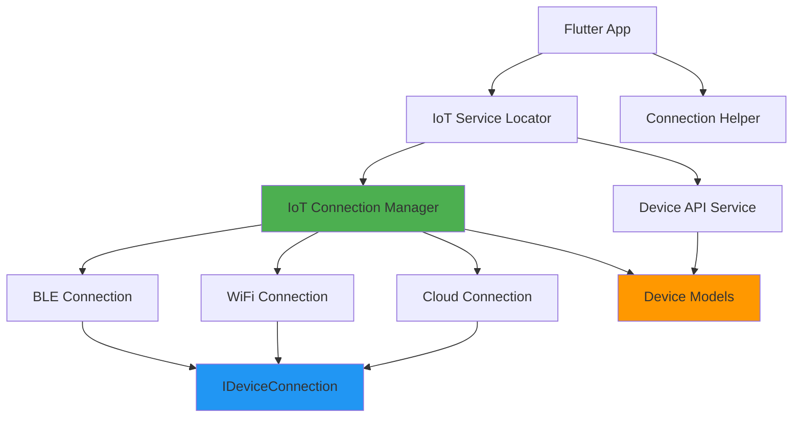
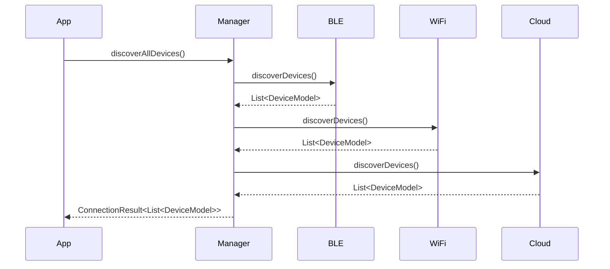
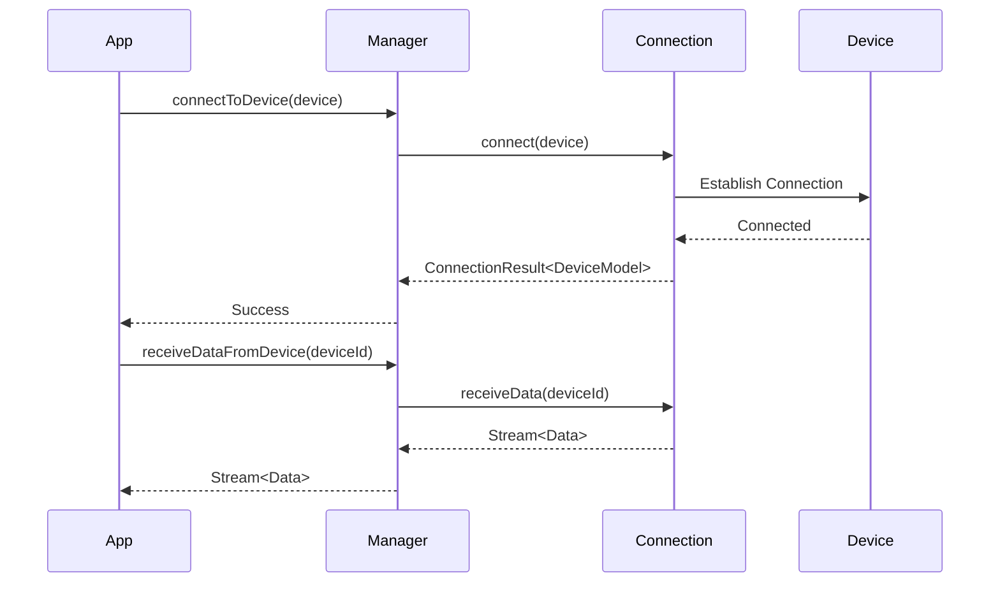
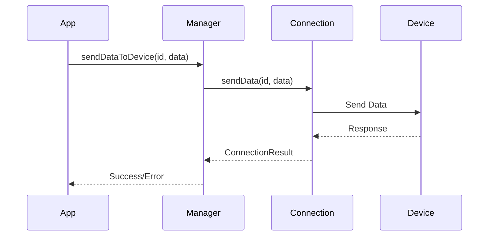

# Architecture Documentation

## Overview

Flutter IoT Helper adalah library modular untuk manajemen koneksi IoT device dengan support untuk multiple protocols (BLE, WiFi, Cloud).

## Architecture Diagram



## Layer Architecture

### 1. Presentation Layer (App)
- UI Components
- State Management
- User Interactions

### 2. Service Layer
**IoTConnectionManager**
- Centralized connection management
- Device discovery orchestration
- Connection lifecycle management
- Multi-device support

**DeviceApiService**
- REST API integration
- Device CRUD operations
- Data fetching
- Command execution

### 3. Connection Layer
**IDeviceConnection (Interface)**
- Common interface for all connection types
- Enforces consistent API

**BLE Connection**
- flutter_blue_plus integration
- Scan & connect to BLE devices
- GATT services & characteristics
- Notification handling

**WiFi Connection**
- Local network discovery
- HTTP communication
- Polling for data updates
- Network info utilities

**Cloud Connection**
- REST API client
- Token authentication
- Remote device access
- Real-time polling

### 4. Model Layer
**DeviceModel**
- Device information
- Connection type
- Status tracking

**ConnectionResult**
- Operation results
- Error handling
- Type-safe responses

### 5. Helper Layer
**IoTServiceLocator**
- Dependency injection (GetIt)
- Service initialization
- Singleton management

**ConnectionHelper**
- Validation utilities
- Format conversion
- Status helpers

## Data Flow

### Device Discovery Flow



### Connection Flow



### Data Communication Flow



## Design Patterns

### 1. Strategy Pattern
- `IDeviceConnection` interface
- Multiple implementations (BLE, WiFi, Cloud)
- Runtime selection based on device type

### 2. Service Locator Pattern
- `IoTServiceLocator` with GetIt
- Centralized service access
- Lazy singleton initialization

### 3. Repository Pattern
- `DeviceApiService` as repository
- Data access abstraction
- API encapsulation

### 4. Observer Pattern
- RxDart streams
- Reactive state updates
- Real-time data streaming

### 5. Factory Pattern
- DeviceModel.fromJson()
- ConnectionResult factories
- Type-safe object creation

## State Management

### Connection States
```dart
enum DeviceStatus {
  disconnected,
  connecting,
  connected,
  error,
}

enum ConnectionManagerStatus {
  idle,
  discovering,
  connecting,
  error,
}
```

### Stream-based State
- Device list stream
- Active connections stream
- Status stream
- Data streams per device

## Error Handling

### ConnectionResult Type
```dart
enum ConnectionResultType {
  success,
  error,
  timeout,
  unauthorized,
}
```

### Error Propagation
1. Low-level exceptions caught
2. Converted to ConnectionResult
3. Logged for debugging
4. Propagated to UI

## Scalability Considerations

### Adding New Connection Types
1. Implement `IDeviceConnection` interface
2. Add to `IoTConnectionManager`
3. Update `DeviceConnectionType` enum
4. Add specific configuration

### Custom Data Parsers
- Extend connection classes
- Override `receiveData()` method
- Implement custom parsing logic

### Multiple Instances
- Service locator supports multiple managers
- Each manager independent
- Separate configurations possible

## Performance Optimization

### BLE
- Efficient characteristic caching
- Connection pooling
- Notification-based updates

### WiFi
- Configurable polling intervals
- Concurrent discovery with batching
- Connection reuse

### Cloud
- Request caching
- Token management
- Retry strategies

## Security Considerations

### BLE
- Pairing & bonding support
- Encrypted characteristics
- Device authentication

### WiFi
- HTTPS support
- Certificate validation
- Local network isolation

### Cloud
- Token-based auth
- API key management
- Secure storage (SharedPreferences)

## Testing Strategy

### Unit Tests
- Model serialization
- Helper functions
- Validation logic

### Integration Tests
- Connection workflows
- API communication
- State management

### Mock Objects
- Mockito for services
- Test doubles for connections
- Fake devices for testing

## Future Enhancements

1. **WebSocket Support**
   - Real-time bidirectional communication
   - Reduced latency
   - Connection efficiency

2. **MQTT Protocol**
   - IoT standard protocol
   - Pub/Sub pattern
   - QoS support

3. **Auto-Reconnect**
   - Connection monitoring
   - Automatic recovery
   - Exponential backoff

4. **Offline Support**
   - Data caching
   - Queue management
   - Sync on reconnect

5. **Connection Analytics**
   - Performance metrics
   - Connection statistics
   - Usage patterns

6. **Device Grouping**
   - Multi-device operations
   - Group management
   - Batch commands

## Dependencies Graph

```
flutter_iot_helper
├── flutter_blue_plus (BLE)
├── connectivity_plus (Network)
├── network_info_plus (WiFi info)
├── dio (HTTP client)
├── http (HTTP requests)
├── rxdart (Streams)
├── get_it (DI)
├── logger (Logging)
└── shared_preferences (Storage)
```

## Best Practices

1. **Always dispose connections** when done
2. **Handle all error cases** with ConnectionResult
3. **Monitor connection status** before operations
4. **Use streams** for real-time data
5. **Initialize services** before use
6. **Validate device info** before connecting
7. **Log important events** for debugging
8. **Update API keys** securely
9. **Test on real devices** for BLE/WiFi
10. **Follow Flutter guidelines** for async operations
